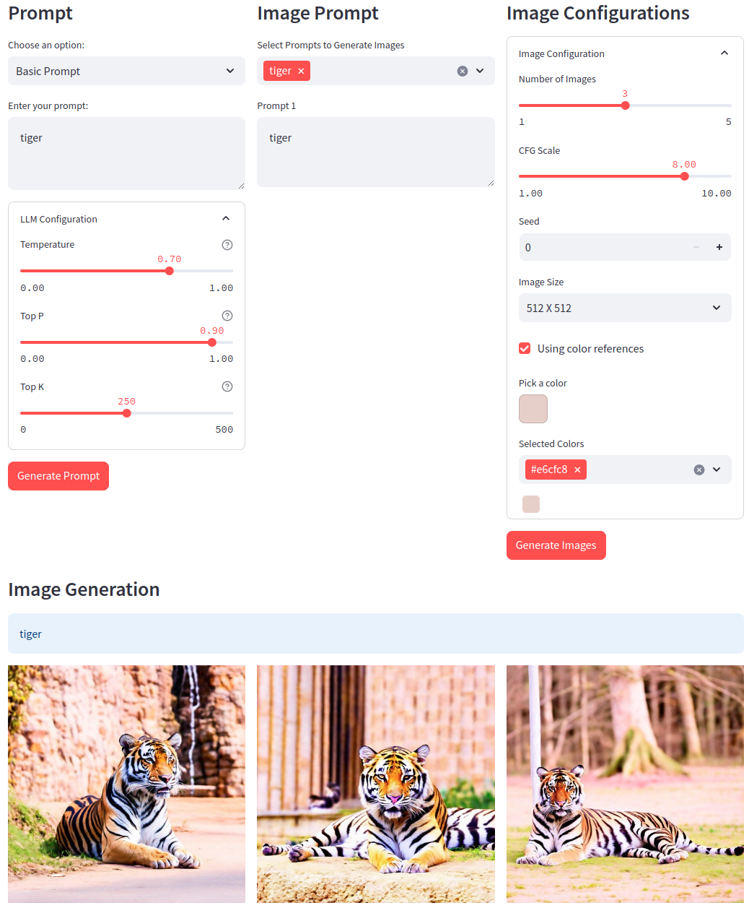
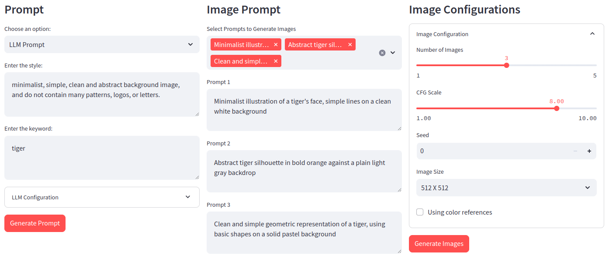
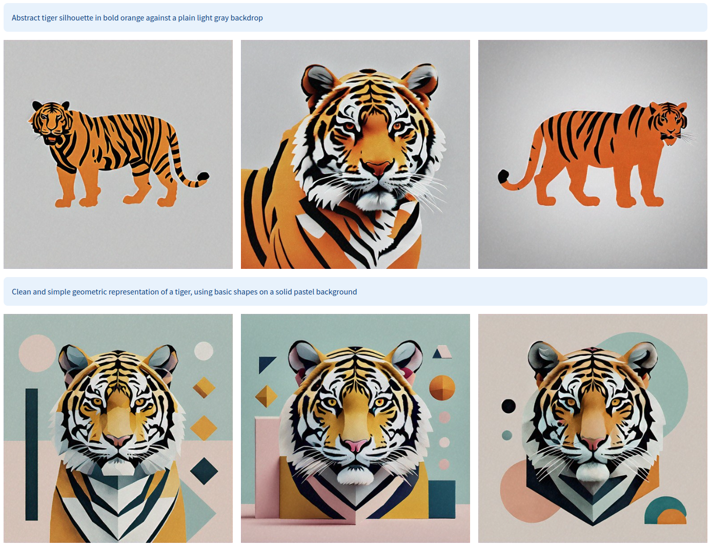
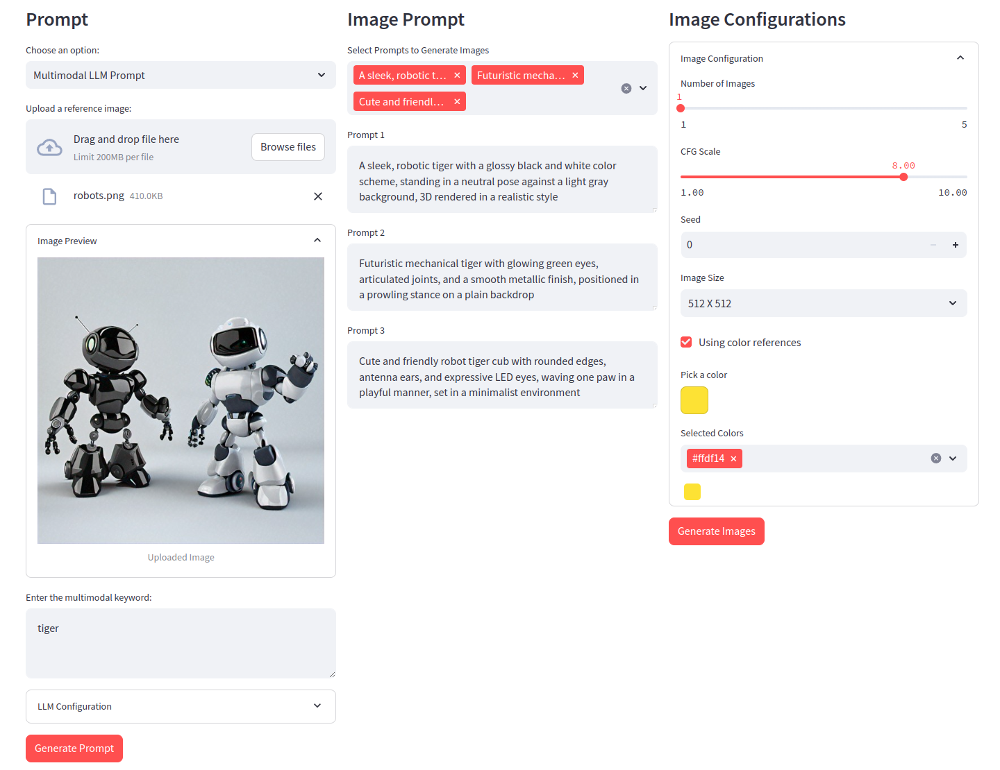
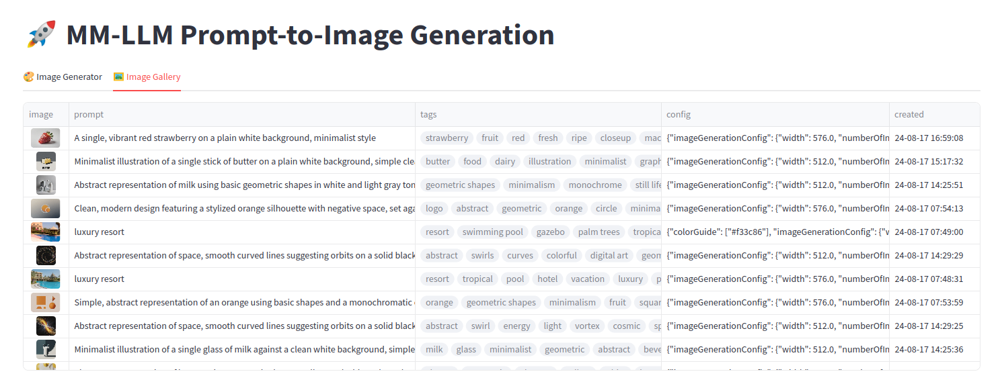

# Multimodal Prompt-to-Image Generation

이미지 생성 모델을 사용하여 원하는 이미지를 생성하려면 프롬프트에서 이미지의 세부 사항을 정확하게 설명하는 것이 중요합니다. 그러나 사전 정보 없이 자세한 프롬프트를 만드는 것은 어려울 수 있습니다. 이를 돕기 위해 Multimodal LLM을 통해 사용자가 제공하는 스타일과 키워드를 기반으로 한 창의적인 이미지 프롬프트 아이디어를 제안합니다. 이를 통해 사용자는 보다 직관적으로 이미지 프롬프트를 생성할 수 있으며, 프롬프트 작성에 소요되는 노력을 줄일 수 있습니다.

이미지 생성 모델은 [Amazon Titan Image Generator G1 v2](https://aws.amazon.com/ko/blogs/korea/amazon-titan-image-generator-v2-is-now-available-in-amazon-bedrock/)를 사용합니다.

## Getting Started

```sh
pip install -r requirements.txt
streamlit run app.py
# or
docker build -t image-gen-gallery .
docker run -p 8000:8000 image-gen-gallery
```

## Preview

### Basic Prompt

기본 이미지 생성 프롬프트를 사용했을 때 입니다. Titan Image Generator의 `COLOR_GUIDED_GENERATION` 기능을 활용하면, 설정한 색상 팔레트를 기반으로 이미지를 생성합니다.



### LLM Prompt

LLM으로부터 Image Generation을 위한 프롬프트를 생성한 결과입니다. `style`, `keyword` 값을 입력하면, 해당 내용을 바탕으로 3개의 이미지 프롬프트를 제안합니다.

- `style`: 원하는 무드나 스타일
- `keyword`: 생성하고자 하는 이미지의 키워드





### MM-LLM Prompt

Titan Image Generator 는 레퍼런스 이미지를 참조하여 새로운 이미지를 생성하는 몇 가지 옵션을 제공합니다.

- **Image Conditioning**: 텍스트 프롬프트를 따르면서 참조 이미지의 레이아웃 및 구성과 일치하는 이미지를 생성
  - 단순히 기존 이미지를 재구성하는 데 그칠 수 있어, 창의적인 자유도가 제한
- **Color Guided Generation**: `referenceImage`를 통해 참조 색상들을 받아와 이미지의 색상 톤을 반영
  - 일부 색상 톤을 반영하지만 이미지의 분위기나 재질 등을 반영하기 어려움
- **Image Variation**: 소스 이미지는 보존하고, 스타일과 배경을 변형한 이미지 생성
  - 변형의 범위가 제한적이고 원본 이미지에 제약이 있음

위 방법들은 레퍼런스 이미지의 특정 속성(색상, 레이아웃, 소스 이미지 등)을 반영하는 데에는 유용하지만, 변형의 범위가 제한적이다 보니 창의적이고 복합적인 특징을 반영한, 완전히 새로운 이미지를 생성하는 데에 한계가 있습니다. Multimodal LLM을 통해 레퍼런스 이미지를 이해하고, 이를 바탕으로 타겟하는 이미지를 생성하도록 프롬프트를 생성하면 더 자유롭고 창의적인 이미지 프롬프트 생성이 가능합니다.




### Imaeg Gallery



생성된 이미지는 Amazon S3에 저장되고, 해당 이미지의 CloudFront URL과 메타데이터는 DynamoDB에 저장됩니다. 사용자는 저장된 데이터를 기반으로 생성된 이미지를 확인할 수 있습니다.
